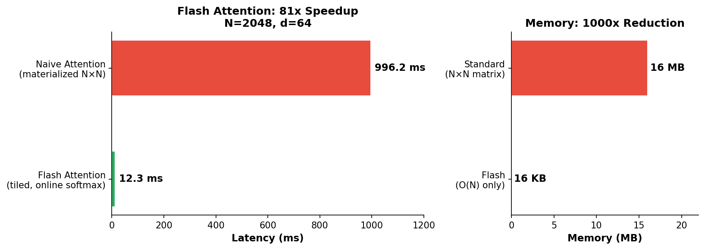

# inference-kernel-cookbook

**81x speedup. 1000x memory reduction. 3 self-contained CUDA files. No frameworks.**

The LLM inference techniques that power vLLM, TensorRT-LLM, and SGLang — implemented from scratch so you can read every line. ~990 lines of CUDA total.



## Why this exists

Production inference engines (vLLM, TensorRT-LLM, SGLang) are 100k+ lines of intertwined code. Papers describe algorithms but not implementations. This cookbook bridges the gap: each technique is isolated into a single file so you can understand **exactly how it works** without reading an entire engine.

Companion to [tensor-core-from-scratch](https://github.com/waynehacking8/tensor-core-from-scratch) — that project teaches the matmul kernel; this one teaches everything built on top of it.

## Recipes

Measured on **NVIDIA RTX PRO 6000 Blackwell** (sm_120) with CUDA 12.8.

| # | Recipe | What It Does | Key Result |
|---|--------|-------------|------------|
| 01 | **Flash Attention** | Tiled attention with online softmax — no N×N matrix | 81x speedup vs naive, 16 MB → 16 KB memory |
| 02 | **KV Cache** | Cache K,V across decode steps — avoid O(N²) recomputation | 0.05 ms/token with cache vs recomputing everything |
| 03 | **Paged Attention** | Virtual-memory-style KV cache — eliminate fragmentation | Exact same result with scattered physical memory |

## Quick Start

```bash
git clone https://github.com/waynehacking8/inference-kernel-cookbook.git
cd inference-kernel-cookbook

make ARCH=sm_120    # or sm_90 (Hopper), sm_89 (Ada Lovelace)
make run K=01_flash_attention
```

You should see:

```
=== Recipe 01: Flash Attention (Forward Pass) ===

GPU: NVIDIA RTX PRO 6000 Blackwell Max-Q Workstation Edition (SM 12.0)

Sequence length: N=2048, Head dim: d=64
Standard attention memory: 16.0 MB (N×N matrix)
Flash attention memory: 16.0 KB (no N×N matrix)

Naive attention:            996.18 ms    0.001 TFLOPS
Flash attention:             12.28 ms    0.087 TFLOPS  (81.1x speedup)

  flash vs naive                      max=0.000000 avg=0.00000000 [PASS]
```

## What You Learn From Each Recipe

### 01 — Flash Attention

The paper that changed everything (Dao et al., 2022). Standard attention materializes an N×N matrix — Flash Attention never does. It uses the **online softmax trick**: as you process each K/V block, track the running max and sum, rescale previous partial results when a new max appears. Same result, O(N) memory instead of O(N²).

### 02 — KV Cache

During autoregressive generation, each new token attends over ALL previous tokens. Without caching, you recompute K and V projections for every past token at every step. The KV cache stores them once and reuses them — turning O(N²) total work into O(N) per step. This recipe shows the prefill→decode pipeline.

### 03 — Paged Attention

The core idea behind vLLM (Kwon et al., 2023). Instead of allocating a contiguous buffer per sequence, split the KV cache into fixed-size pages and use a page table (like OS virtual memory). This eliminates memory fragmentation and pushes utilization from ~50% to ~95%+. The recipe shows the kernel operating on physically scattered pages and producing exact same results.

## How These Techniques Connect

```
                ┌──────────────┐
                │  Transformer │
                │    Layer     │
                └──────┬───────┘
                       │
            ┌──────────┴──────────┐
            │                     │
     ┌──────┴──────┐    ┌────────┴────────┐
     │  Attention   │    │  Feed-Forward    │
     │  (01, 02, 03)│    │  (GEMM kernels)  │
     └──────────────┘    └─────────────────┘

  01 Flash Attention ─── how to compute attention efficiently
  02 KV Cache ────────── how to avoid recomputation across steps
  03 Paged Attention ─── how to manage KV cache memory at scale
```

## Requirements

- CUDA Toolkit 12.8+
- NVIDIA GPU with compute capability 7.0+ (Volta or later)
- ~1 GB GPU memory for the default problem sizes

## Related projects

- **[tensor-core-from-scratch](https://github.com/waynehacking8/tensor-core-from-scratch)** — The matmul kernel that underlies everything here. Start there if you want to understand the GPU fundamentals first.
- **[trtllm-triton-serving](https://github.com/waynehacking8/trtllm-triton-serving)** — These techniques in production: TensorRT-LLM vs vLLM head-to-head on H100.
- **[nccl-collectives-bench](https://github.com/waynehacking8/nccl-collectives-bench)** — The multi-GPU communication layer: NCCL benchmarks on 8×H100 NVSwitch.

## Acknowledgments

Inspired by [Andrej Karpathy](https://github.com/karpathy)'s "from scratch" philosophy. References: [FlashAttention](https://arxiv.org/abs/2205.05198) (Dao et al., 2022), [PagedAttention/vLLM](https://arxiv.org/abs/2309.06180) (Kwon et al., 2023).

## License

MIT
